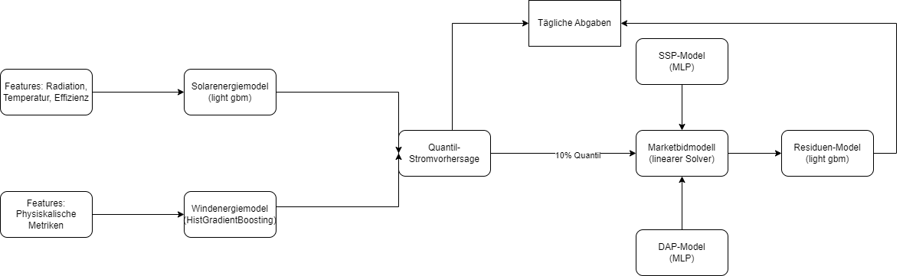

# Energy_production_price_prediction

Dieses Repository dokumentiert unsere verspätete Teilnahme an der HEFTcom24 Challenge (https://ieee-dataport.org/competitions/hybrid-energy-forecasting-and-trading-competition), bei der wir für einen Monat die Energiemengen aus Solar- und Windkraftanlagen durch Quantilsvorhersagen prognostizieren. Außerdem erstellten wir Marktgebote (Market Bids), um unseren Umsatz zu maximieren.

Unsere Performance über den Monat hinweg kann auf dieser Seite unter dem Teamnamen "A-Team" verfolgt werden: https://www.rebase.energy/challenges/heftcom2024?participant_id=16908787-8fb8-4fb7-a8eb-a6ae12b355b.

Alle API-Anfragen und Abgaben wurden automatisiert. Unsere Prognosen und Gebote basieren auf der Architektur, die in diesem Diagramm dargestellt ist:

